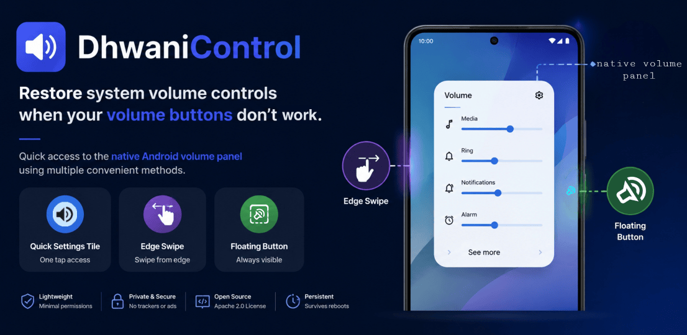

#  DhwaniControl

<!--  -->

**DhwaniControl** is an Android utility designed to restore volume control functionality for devices with broken or unresponsive physical volume buttons. Access the native system volume panel via Quick Settings, Edge Gestures, or a persistent Floating Button.

---

## 📋 Table of Contents

- [📥 Get the App](#-get-the-app)
- [✨ Pro Features](#-pro-features)
- [📖 Detailed Documentation](#-detailed-documentation)
- [🧐 Why it exists](#-why-it-exists)
- [🛠 Tech & Performance](#-tech--performance)
- [📄 License](#-license)

---

## 📥 Get the App

### Direct Download

---

## ✨ Pro Features

- **🚀 Quick Settings Tile**: Seamlessly integrated into your notification shade. Access your volume controls with a single tap from anywhere.
- **↔️ Edge Swipe Gestures**: Trigger the volume panel with a discreet inward swipe from either the left or right edge of your screen.
- **🔘 Custom Floating Button**: A persistent, movable on-screen trigger. Personalize it with custom icons, colors, and adjustable opacity.
- **🎨 Material 3 Design**: Built with the latest Android design standards for a modern, clean, and fully responsive user interface.
- **🔋 Battery Optimized**: Engineered with high-efficiency foreground services to ensure constant availability without compromising your device's battery life.
- **🔒 Privacy Driven**: Your data stays yours. No trackers, no unnecessary permissions, and 100% open-source for full transparency.

---

## 📖 Detailed Documentation

---

## 🧐 Why it exists

DhwaniControl was born out of necessity. When physical volume buttons fail, navigating through system settings just to adjust audio levels becomes a significant daily friction.

Originally developed as a personal tool to overcome hardware limitations, it has been open-sourced to provide a reliable, efficient, and customizable solution for anyone facing similar hardware challenges.

---

## 🛠 Tech & Performance

DhwaniControl is built with performance and longevity in mind:
- **Language**: Kotlin
- **Toolchain**: Java 21 & Gradle 9.6.1
- **Optimization**: R8 Full Mode for minimal binary size and code obfuscation.
- **Android Support**: Fully optimized for Android 10 (API 29) up to Android 17 (API 37).

---

## 📄 License

Licensed under the **[Apache License 2.0](https://www.apache.org/licenses/LICENSE-2.0)**. See the [LICENSE](LICENSE) for more info.

  

